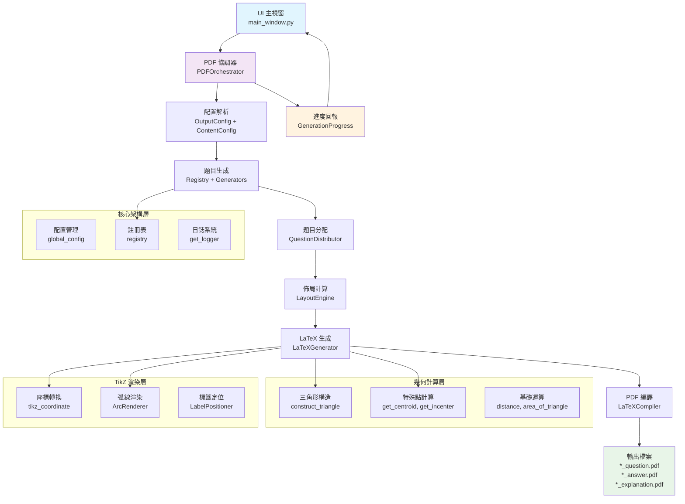

# PDF 生成工作流程 (LaTeX 版本)

本文件描述了使用 LaTeX 生成 PDF 測驗卷的工作流程。

## 流程概述

使用者透過 UI 介面觸發 PDF 生成，`pdf_generator` 模組負責協調題目生成、佈局、LaTeX 內容創建和 PDF 編譯等步驟，最終產生三個獨立的 PDF 檔案（題目卷、簡答卷、詳解卷）。

## 詳細步驟

1.  **UI (使用者介面)**
    *   收集使用者輸入的參數：題型、數量、回數 (`rounds`)、每回題數 (`questions_per_round`)、測驗標題 (`test_title`)、輸出位置等。
    *   調用 `utils.pdf_generator.generate_pdf` 函數，傳遞參數（通常包含一個完整的輸出路徑 `output_path`）。

2.  **`utils.pdf_generator.generate_pdf` (兼容函數)**
    *   **輸入**: `output_path`, `test_title`, `selected_data`, `rounds`, `questions_per_round` 等。
    *   從 `output_path` 解析出輸出目錄 `output_dir` 和文件名前綴 `filename_prefix`。
    *   **輸出**: 調用核心函數 `generate_latex_pdfs`，傳遞解析後的參數。

3.  **`utils.pdf_generator.generate_latex_pdfs` (核心協調函數)**
    *   **輸入**: `output_dir`, `filename_prefix`, `test_title`, `selected_data`, `rounds`, `questions_per_round`。
    *   **步驟 3.1**: 調用 `_generate_raw_questions`，根據 `selected_data` 從各個題目生成器 (`generators/`) 獲取原始題目列表 `raw_questions`。
    *   **步驟 3.2**: 調用 `_distribute_questions`，對 `raw_questions` 進行題型分佈處理和回內排序，得到有序題目列表 `ordered_questions`。
    *   **步驟 3.3**: 實例化 `LayoutEngine` (`utils/layout_engine.py`)。
    *   **步驟 3.4**: 調用 `layout_engine.layout`，傳入 `ordered_questions` 和 `questions_per_round`，計算題目佈局，得到 `layout_results` (包含頁碼 `page` 和位置 `row`, `col`)。
    *   **步驟 3.5**: 實例化 `LaTeXGenerator` (`utils/latex_generator.py`)。
    *   **步驟 3.6**: 調用 `latex_generator.generate_question_tex`，傳入 `layout_results`, `test_title`, `questions_per_round`，生成題目卷的 `.tex` 內容字串。
    *   **步驟 3.7**: 調用 `latex_generator.generate_answer_tex`，傳入 `ordered_questions`, `test_title`，生成簡答卷的 `.tex` 內容字串。
    *   **步驟 3.8**: 調用 `latex_generator.generate_explanation_tex`，傳入 `ordered_questions`, `test_title`，生成詳解卷的 `.tex` 內容字串。
    *   **步驟 3.9**: 實例化 `PDFCompiler` (`utils/pdf_compiler.py`)。
    *   **步驟 3.10**: 調用 `pdf_compiler.compile_tex_to_pdf` 三次，分別編譯三個 `.tex` 字串，生成三個 PDF 檔案 (`*_question.pdf`, `*_answer.pdf`, `*_explanation.pdf`) 到 `output_dir`。
    *   **輸出**: 返回布林值，表示所有 PDF 是否成功生成。

4.  **UI 顯示結果**
    *   根據 `generate_pdf` 返回的結果，向使用者顯示成功或失敗訊息。

## 🔄 新架構流程圖



## 💡 新 API 使用範例

### 基本使用方式

```python
# 1. 導入協調器
from utils.orchestration.pdf_orchestrator import PDFOrchestrator, OutputConfig, ContentConfig

# 2. 創建配置
output_config = OutputConfig(
    output_dir="./output",
    filename_prefix="math_test_001"
)

content_config = ContentConfig(
    test_title="高中數學測驗",
    selected_data=[...],  # 題型選擇數據
    rounds=3,
    questions_per_round=10
)

# 3. 生成 PDF
orchestrator = PDFOrchestrator()
result = orchestrator.generate_pdfs(output_config, content_config)

if result.success:
    print(f"✅ 成功生成 {len(result.generated_files)} 個檔案")
    for file in result.generated_files:
        print(f"   📄 {file}")
else:
    print(f"❌ 生成失敗: {result.error_message}")
```

### 帶進度回報的使用方式

```python
from utils.orchestration.pdf_orchestrator import generate_pdf_with_progress

def progress_callback(progress):
    print(f"[{progress.current_stage.value}] {progress.current_task} ({progress.progress_percent:.1f}%)")
    if progress.error_message:
        print(f"❌ 錯誤: {progress.error_message}")

success = generate_pdf_with_progress(
    output_path="./output/test.pdf",
    test_title="數學測驗",
    selected_data=selected_data,
    rounds=2,
    questions_per_round=15,
    progress_callback=progress_callback
)
```

### 幾何功能使用範例

```python
# 導入統一 API
from utils import construct_triangle, get_centroid, create_simple_triangle_figure

# 構造三角形
triangle = construct_triangle("sss", side_a=3, side_b=4, side_c=5)

# 計算質心
centroid = get_centroid(triangle)
print(f"質心座標: ({centroid.x:.2f}, {centroid.y:.2f})")

# 生成完整圖形數據
figure_data = create_simple_triangle_figure(
    "sss", side_a=5, side_b=6, side_c=7
)
print(f"TikZ 代碼:\n{figure_data['tikz_code']}")
```

## 🆚 新舊API對比

| 項目 | 舊API | 新 API |
|------|--------|--------|
| **主要入口** | `utils.pdf_generator.generate_pdf()` | `PDFOrchestrator.generate_pdfs()` |
| **配置方式** | 函數參數 | 結構化配置物件 (`OutputConfig`, `ContentConfig`) |
| **進度回報** | 無 | 完整進度回報系統 (`GenerationProgress`) |
| **錯誤處理** | 簡單布林值 | 詳細錯誤訊息和統計資料 |
| **模組結構** | 單一大檔案 | 6 層模組化架構 |
| **幾何計算** | `geometry_utils.py` (969 行) | 模組化幾何系統 (3000+ 行) |
| **TikZ 處理** | 內嵌在生成器 | 專門 TikZ 模組 |
| **測試覆蓋** | 有限 | 完整單元測試 |
| **文檔** | 無 | Sphinx 專業文檔 |

## 📁 檔案結構對應

```
新架構:
├── utils/
│   ├── orchestration/          # 協調層 (原 pdf_generator)
│   │   ├── pdf_orchestrator.py # 主要協調器
│   │   ├── question_distributor.py
│   │   └── progress_reporter.py
│   ├── core/                   # 核心功能
│   │   ├── config.py          # 配置管理
│   │   ├── registry.py        # 生成器註冊
│   │   └── layout.py          # 佈局引擎
│   ├── latex/                  # LaTeX 處理
│   │   ├── generator.py       # LaTeX 生成器
│   │   └── compiler.py        # PDF 編譯器
│   ├── geometry/               # 幾何計算 (原 geometry_utils)
│   │   ├── basic_ops.py
│   │   ├── triangle_construction.py
│   │   └── triangle_centers.py
│   └── tikz/                   # TikZ 處理
│       ├── coordinate_transform.py
│       └── arc_renderer.py
└── generators/                 # 題目生成器