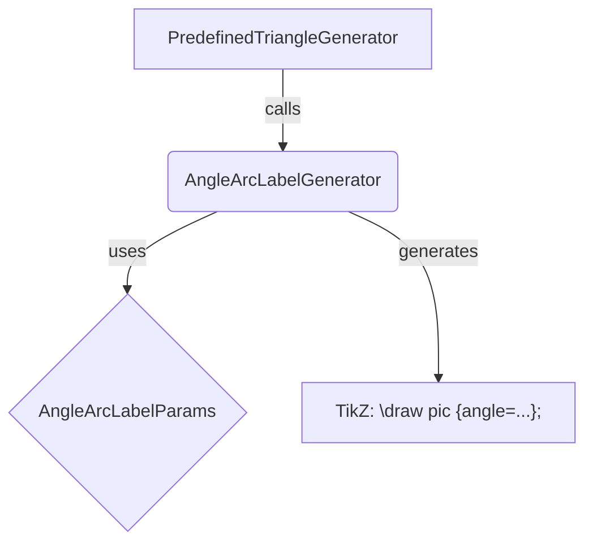
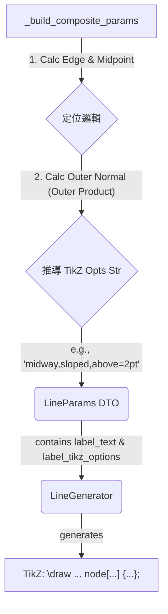

# 預定義三角形圖形標籤優化計劃

## 1. 目標

本計劃旨在全面提升數學測驗生成器中預定義三角形圖形（由 `predefined_triangle_coordinates`, `predefined_triangle_sss`, `predefined_triangle_sas`, `predefined_triangle_asa`, `predefined_triangle_aas`, `predefined_triangle_rhs` 生成器產生）的標籤（包括角度標籤、頂點標籤和邊長標籤）的放置美觀度、可讀性，並最大限度地減少標籤與圖形元素或其他標籤之間的重疊。

## 2. 核心原則

-   **Python 端主導計算**：主要的幾何計算、定位邏輯決策將在 Python 的圖形生成器層面完成。
-   **生成精確的 TikZ 指令**：Python 代碼將致力於生成更精確、更符合 TikZ 風格的底層繪製指令，以充分利用 TikZ 的強大功能。
-   **增強基礎組件**：優先考慮增強可重用的基礎圖形組件（如 `LineGenerator`）的功能，以支持更豐富的表現。
-   **逐步實施**：按優先級分階段實現各項優化。

## 3. 詳細方案與實施步驟

### 3.1. 角度標籤優化 (最高優先級)

**目標**：將角度標籤（如 "30.0°"）放置在角弧內部或緊鄰角弧的位置，並與角弧本身集成繪製。

**方案**：創建一個新的基礎圖形類型 `angle_arc_with_label`，使用 TikZ 的 `pic` 功能實現。

**步驟**：

1.  **定義參數模型 `AngleArcLabelParams`** (在 [`figures/params_models.py`](figures/params_models.py)):
    ```python
    class AngleArcLabelParams(BaseFigureParams):
        vertex_x: float
        vertex_y: float
        point1_x: float # 角的一條邊上的點 (從 vertex 指向 point1)
        point1_y: float
        point2_x: float # 角的另一條邊上的點 (從 vertex 指向 point2)
        point2_y: float
        label_text: Optional[str] = None
        radius: float = 0.4 # 角弧的半徑 (cm)
        draw_options: str = "draw" # pic 的繪製選項, e.g., "draw, blue"
        label_options: str = r"font=\small" # pic 中標籤的選項, e.g., "font=\scriptsize, text=red"
        pic_options: str = "" # pic 的其他選項, e.g., "angle eccentricity=1.2"
        # 角度單位 (deg/rad) 由調用方確保 label_text 中的單位與實際一致
    ```

2.  **創建基礎圖形生成器 `AngleArcLabelGenerator`** (在 [`figures/angle_arc_label.py`](figures/angle_arc_label.py) - 新文件):
    ```python
    # figures/angle_arc_label.py
    # ... imports ...
    # from ..params_models import AngleArcLabelParams

    # @register_figure_generator # 考慮是否需要全局註冊，或者僅由複合圖形內部使用
    class AngleArcLabelGenerator(FigureGenerator):
        @classmethod
        def get_name(cls) -> str:
            return 'angle_arc_with_label'

        def generate_tikz(self, params: Dict[str, Any]) -> str:
            # validated_params = AngleArcLabelParams(**params)
            # vx, vy = validated_params.vertex_x, validated_params.vertex_y
            # p1x, p1y = validated_params.point1_x, validated_params.point1_y
            # p2x, p2y = validated_params.point2_x, validated_params.point2_y
            # label = validated_params.label_text if validated_params.label_text is not None else ""
            # radius_cm = validated_params.radius
            # draw_opts = validated_params.draw_options
            # label_opts = validated_params.label_options
            # pic_opts = validated_params.pic_options
            
            # # 為了在 pic 中使用座標，最好先定義 TikZ coordinates
            # tikz_code = []
            # tikz_code.append(f"\\coordinate (AngleVertex) at ({vx:.3f},{vy:.3f});")
            # tikz_code.append(f"\\coordinate (AngleP1) at ({p1x:.3f},{p1y:.3f});")
            # tikz_code.append(f"\\coordinate (AngleP2) at ({p2x:.3f},{p2y:.3f});")
            
            # # 構造 pic 命令
            # # 注意：TikZ pic label 的引號處理，如果 label_text 包含特殊字符，可能需要轉義
            # # 簡單起見，假設 label_text 是簡單文本或已包含 $...$
            # pic_command = f"\\draw pic[{draw_opts}, angle radius={radius_cm}cm"
            # if label:
            #     pic_command += f", \"{label}\"" # 標籤文本用引號包裹
            # if pic_opts:
            #     pic_command += f", {pic_opts}"
            # if label_opts: # label_options 應該直接作用於 pic 的標籤部分
            #     pic_command += f", label/.append style={{{label_opts}}}" # 待驗證此語法
            #     # 或者 pic label options 可能有特定語法，如 angle label node/.style={...}
            # pic_command += f"] {{angle=AngleP1--AngleVertex--AngleP2}};"
            # tikz_code.append(pic_command)
            # return "\n".join(tikz_code)
            
            # 更簡潔的實現，直接傳遞座標值給 pic，如果 TikZ pic 支持
            # 查閱 TikZ 手冊，pic angle 操作符似乎直接使用已定義的座標名稱
            # 因此，先定義座標是必要的。
            # 關於標籤選項，TikZ pic 的 "label" 通常是 `"<label text>"`
            # 其他選項如 `angle eccentricity`, `angle label position` 等。
            # 我們可以將 label_options 設計為更底層的 TikZ 字符串。
            pass # 佔位符，具體實現待定
    ```
    *註：`AngleArcLabelGenerator` 的具體 TikZ 生成邏輯需要仔細參考 TikZ `pic` 的 `angle` 操作文檔，確保標籤和樣式選項能正確應用。*

3.  **修改所有六個預定義三角形生成器** (`_build_composite_params` 方法):
    *   當需要標註角度時（`params.show_angle_X_label` 為 `True`）：
        *   不再創建 `type="label"` 的子圖形。
        *   而是創建一個 `type="angle_arc_with_label"` 的子圖形。
        *   其 `params` 應包含：
            *   `vertex_x, vertex_y`: 當前角頂點 (sp_A, sp_B, 或 sp_C) 的座標。
            *   `point1_x, point1_y`: 構成該角的一條邊的另一個端點的座標。
            *   `point2_x, point2_y`: 構成該角的另一條邊的另一個端點的座標。
            *   `label_text`: 計算好的一位小數角度文本（例如 `"30.0°"`）。
            *   `radius`: 可以從 `PredefinedTriangleBaseParams` 中新增一個 `angle_arc_radius` 參數獲取，或使用默認值。
            *   `draw_options`, `label_options`, `pic_options`: 可以從 `PredefinedTriangleBaseParams` 中新增相應參數，或使用默認值。
        *   `params.angle_X_notation` 可以用來影響 `draw_options`（例如，`"right_angle"` 可能對應特定的 `pic` 類型或選項，或者仍然需要一個獨立的直角符號圖形）。

### 3.2. 頂點標籤優化 (次高優先級)

**目標**：將頂點標籤（A, B, C）自動放置在三角形外部，並減少與圖形其他部分的重疊。

**方案**：基於頂點相對於三角形重心的位置，動態選擇標籤的 `position` 參數。

**步驟** (在各預定義三角形生成器的 `_build_composite_params` 方法中):

1.  **計算重心 G**: 一旦獲得三個頂點 `sp_A`, `sp_B`, `sp_C` 的 SymPy `Point` 對象，計算重心 `G = sp_A.centroid(sp_B, sp_C)` (或手動計算 `((Ax+Bx+Cx)/3, (Ay+By+Cy)/3)`）。
2.  **為每個頂點 P (sp_A, sp_B, sp_C) 確定標籤位置**:
    *   獲取 P 的座標 `(Px, Py)` 和 G 的座標 `(Gx, Gy)`。
    *   比較 `Px` 與 `Gx`，`Py` 與 `Gy`，以確定 G 相對於 P 的象限或軸向。
    *   根據此相對位置，為頂點 P 的 `label` 子圖形選擇一個“反方向”的 `position` 字符串。例如：
        *   若 G 在 P 的右上方 (`Gx > Px`, `Gy > Py`)，則 `position = "below left"`。
        *   若 G 在 P 的右下方 (`Gx > Px`, `Gy < Py`)，則 `position = "above left"`。
        *   若 G 在 P 的左上方 (`Gx < Px`, `Gy > Py`)，則 `position = "below right"`。
        *   若 G 在 P 的左下方 (`Gx < Px`, `Gy < Py`)，則 `position = "above right"`。
        *   處理 G 與 P 在 x 或 y 軸對齊的特殊情況（例如，G 在 P 正右方，則 `position = "left"`）。
    *   可以加入一個小的固定偏移（例如，通過 `label` 的 `offset` 參數，如果 `LabelGenerator` 支持，或者微調 `position` 字符串如 `below left=1pt`）。
3.  **更新 `label` 子圖形參數**: 將計算出的 `position` 字符串傳遞給頂點 `label` 子圖形的 `params`。

### 3.3. 邊長標籤優化 (次高優先級)

**目標**：將邊長標籤放置在對應邊的中點附近、三角形的外部，並且標籤文本方向盡可能與邊平行。

**方案**：
1.  **定位邏輯（在預定義三角形生成器中實現）**:
    *   **確定環繞方向**: 使用頂點 A, B, C 計算向量 AB 和 AC 的2D外積的z分量 (`cross_z = ABx*ACy - ABy*ACx`)。若為正，則 A-B-C 為逆時針；若為負，則為順時針。
    *   **計算外法線**: 對於每條邊 P1P2 (向量 `v_edge = P2 - P1 = (dx, dy)`):
        *   若三角形為**逆時針**排列，外法線方向 `n_dir = (dy, -dx)` (v_edge 順時針旋轉90度)。
        *   若三角形為**順時針**排列，外法線方向 `n_dir = (-dy, dx)` (v_edge 逆時針旋轉90度)。
    *   **推導 TikZ `node` 選項**:
        *   計算邊的中點 M。
        *   歸一化外法線 `n_out = normalize(n_dir)`。
        *   一個初步的標籤絕對座標可以是 `P_abs_label = M + offset_val * n_out` (其中 `offset_val` 是一個小距離，如 `0.2`)。
        *   **將此絕對定位轉換為相對 TikZ `node` 選項**：這一步是核心。我們需要根據邊的傾斜度和 `n_out` 的方向，決定使用 `above`, `below`, `left`, `right` 中的哪一個（相對於 `midway`），以及是否使用 `sloped`。
            *   例如，如果邊是近乎水平的，且 `n_out` 的 y 分量為正，則選項可以是 `"midway, above=2pt"`。如果 y 分量為負，則是 `"midway, below=2pt"`。
            *   如果邊是近乎垂直的，且 `n_out` 的 x 分量為正，則選項可以是 `"midway, right=2pt"`。如果 x 分量為負，則是 `"midway, left=2pt"`。
            *   對於其他斜向邊，選項可以是 `"midway, sloped, <direction>=2pt"`，其中 `<direction>` (如 `above` 或 `below`) 需要根據 `n_out` 相對於邊的局部“上方”或“下方”來確定。這可能需要比較 `n_out` 與一個標準的“向上”或“向右”參考向量的關係，並考慮邊的斜率。
            *   一個固定的偏移值（如 `2pt` 或 `3pt`）應作為參數。

2.  **實現方式（增強 `LineGenerator`）**:
    *   **修改 `LineParams`** (在 [`figures/params_models.py`](figures/params_models.py)):
        ```python
        class LineParams(BaseFigureParams): # 假設 LineParams 已存在或創建它
            x1: float
            y1: float
            x2: float
            y2: float
            color: str = "black"
            style: str = "solid" # 'solid', 'dashed', 'dotted'
            width: str = "thin"  # 'thin', 'thick', 'ultra thick'
            # ... 其他現有參數 ...
            label_text: Optional[str] = None
            label_tikz_options: Optional[str] = None # e.g., "midway, below=2pt, sloped"
        ```
    *   **修改 `LineGenerator`** (在 [`figures/line.py`](figures/line.py)):
        在其 `generate_tikz` 方法中：
        ```python
        # ... (獲取 x1,y1,x2,y2,color,style,width 等) ...
        # tikz_code = f"\\draw[{width}, {style}, {color}] ({x1:.3f},{y1:.3f}) -- ({x2:.3f},{y2:.3f})"
        # if validated_params.label_text and validated_params.label_tikz_options:
        #     # 確保標籤文本中的特殊 LaTeX 字符被處理，或假設它是安全的
        #     safe_label_text = validated_params.label_text # 可能需要轉義
        #     tikz_code += f" node[{validated_params.label_tikz_options}] {{{safe_label_text}}}"
        # tikz_code += ";"
        # return tikz_code
        pass # 佔位符
        ```
    *   **修改預定義三角形生成器**:
        在其 `_build_composite_params` 中，為每條邊計算出 `label_text`（一位小數的長度）和 `label_tikz_options` 字符串，然後在創建 `line` 類型的 `SubFigureParams` 時傳遞這些參數。

### 3.4. 顯示精度 (已完成)

-   所有計算出的標籤（邊長和角度）的顯示精度已從三位小數改為一位小數。
-   相關的單元測試已更新。

## 4. Mermaid 圖示 (示例)

### 角度標籤組件關係


### 邊長標籤流程 (使用增強的 LineGenerator)


## 5. 實施與測試

-   將按照上述優先級順序，逐個實現和測試各項優化。
-   每次重大修改後，都會運行單元測試，並通過 [`generate_triangle_test_tex.py`](generate_triangle_test_tex.py) 生成的 PDF 進行視覺驗證。
-   單元測試可能需要擴展，以驗證新的標籤定位邏輯和參數。

## 6. 未來可能的進一步優化

-   為 `LabelGenerator` 增加對 `offset` (x,y 偏移) 和 `rotation` 參數的支持。
-   研究更高級的自動碰撞避免算法（可能超出 TikZ 簡單定位的範疇）。
-   允許用戶通過參數更細緻地控制標籤的字體、顏色、背景等樣式。

---

這個計劃比較完整，涵蓋了我們討論的所有要點。